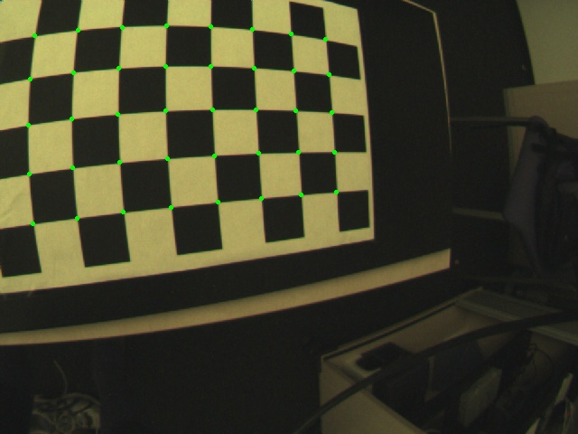
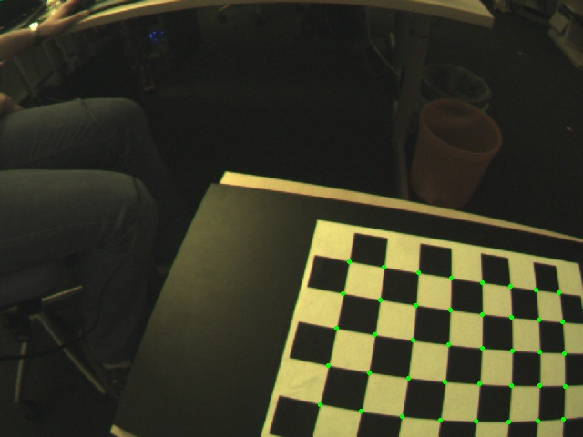
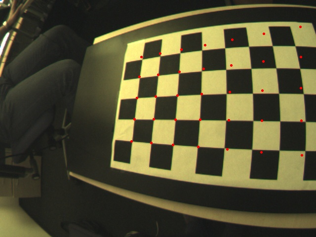

# This Assignment is related to Camera caliberation #

The images directory contains images of a chessboard that were used for calibrating a camera
with high radial distortion. The results of the calibration (intrinsics of the camera and extrinsics
for each board) are stored in data/ex1.mat. You are asked to

1. Write a function project_points for projecting all 3D-points defined by a chessboard
              (in the world coordinate system) to the 2D pixel coordinate system. It should optionally
              regard the radial distortion (k1, k2, k5). The function takes as input a vector of 3D
              world points, the camera’s intrinsic and extrinsic parameters and a flag for considering the
              distortion. It returns the projected 2D-points.
              
              
2. Write a function project_and_draw that takes an image and projects and draws all chessboard
              points onto that image using project_points. Apply this to all images after
              compensating for radial distortion.
              
              
3. In your report, show the first image with the following information:

      * projected points without correction of the distortion in red

      * projected points with correction of the radial distortion (k1, k2 and k5) in green

## Results for Distorted and Undistorted Images

        
###                                                     Distorted Image                                                                                      Undistorted Image   

          

          

          

          

         

          
